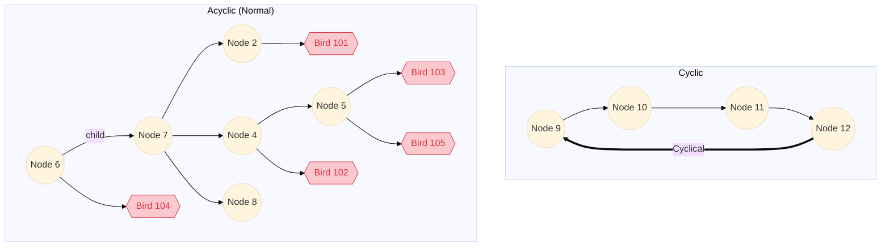

# README

## Steps taken to solve
1. Setup Boilerplate rails application using `rails new birds-api --api -d postgresql`
2. Delete extra goodies we don't need (ActionCable, Etc)
3. Unzip nodes.csv.gz using `gzip -d data/nodes.csv.gz`
4. Create the database `bundle exec rake db:create`
5. Create the model using `rails g model nodes`
6. Create the table using `bundle exec rake db:migrate`
   * Note, I decided not to use foreign key constraints as in the future we may need to add children before their parents.
7. Seed the initial data using `rails db:seed`
8. Write Recursive CTE functions to efficiently traverse trees.
9. Use `fx` gem to facilitate migrations of CTE functions
10. Add `ancestors`, `self_and_ancestors`, `descendents`, `self_and_descendents`, `common_ancestors`, `root`, `depth`, and `lowest_common_ancestor` methods to the model
11. Add `rspec` & `rubocop`
12. Create the api contoller using `rails g controller CommonAncestors`
13. Update the `config/routes.rb`
14. Add the birds model using `rails g model Bird`
15. Add the birds controller using `rails g controller Birds`
16. Use Rubocop to clean up code
17. Add specs to handle cyclical trees.

## Comments on Efficiency and Scalability
In order for this to scale effectively, the goal is to move as much of the logic into Postgres, and out of active record.

By joining window functions (that return recursive CTE's) inside of active record we get the best of both worlds, Highly efficient recursion inside of postgres, and sql composition to easily initialize the objects when we need them.

For example: Calling `node_a.lowest_common_ancestor(node_b)` joins ancestors of each and returns the first result without having to make subsequent calls to the database.

The optimizer is able to see through the function boundry and utilize the indexes of the underlying table.

```
> Node.compare(5497637, 4430546)
  Node Load (1.8ms)  SELECT "nodes".* FROM "nodes" WHERE "nodes"."id" = $1 LIMIT $2  [["id", 5497637], ["LIMIT", 1]] # Find record with id = 5497637
  Node Load (0.4ms)  SELECT "nodes".* FROM "nodes" WHERE "nodes"."id" = $1 LIMIT $2  [["id", 4430546], ["LIMIT", 1]] # Find record with id = 4430546
  Node Load (2.9ms)  SELECT "nodes".* FROM "nodes" join get_ancestors_and_self(5497637) ancestors on nodes.id = ancestors.id join get_ancestors_and_self(4430546) ancestors2 on ancestors.id = ancestors2.id ORDER BY ancestors.depth LIMIT $1 # Find Lowest Common Ancestor (Record 4430546), by joining 2 window function inside of postgres
  Node Load (0.8ms)  SELECT "nodes".* FROM "nodes" join get_ancestors_and_self(130) ancestors on nodes.id = ancestors.id ORDER BY ancestors.depth DESC LIMIT $1  [["LIMIT", 1]] # Once lowest common ancestor is initialized, we make a subsequesnt call to find the root
  Node Count (0.7ms)  SELECT COUNT(*) FROM "nodes" join get_ancestors_and_self(130) ancestors on nodes.id = ancestors.id # And one more call to find the depth

*** Note this can be combined into one query, however since only one row is being returned and initialized in the ruby runtime there is marginal performance gain of aggrigating this inside one postgres function
```

Query Plan
```
Sort  (cost=35.01..35.14 rows=50 width=32)
  Sort Key: ancestors.depth
  ->  Hash Join  (cost=14.35..33.60 rows=50 width=32)
        Hash Cond: (ancestors2.id = nodes.id)
        ->  Function Scan on get_ancestors_and_self ancestors2  (cost=0.25..10.25 rows=1000 width=8)
        ->  Hash  (cost=13.98..13.98 rows=10 width=40)
              ->  Hash Join  (cost=1.29..13.98 rows=10 width=40)
                    Hash Cond: (ancestors.id = nodes.id)
                    ->  Function Scan on get_ancestors_and_self ancestors  (cost=0.25..10.25 rows=1000 width=12)
                    ->  Hash  (cost=1.02..1.02 rows=2 width=28)
                          ->  Seq Scan on nodes  (cost=0.00..1.02 rows=2 width=28)
```

** Hash joins parallelize and scale better than any other join, allowing us to take advantage of postgres parellel query functionality on large data sets (configuration required)

## Recursive CTE Functions
* [get_ancestors(node_id)](db/functions/get_ancestors_v01.sql)
* [get_ancestors_and_self(node_id)](db/functions/get_ancestors_and_self_v01.sql)
* [get_descendants(node_id)](db/functions/get_descendants_v01.sql)
* [get_descendants_and_self(node_id)](db/functions/get_descendants_and_self_v01.sql)
* [get_birds(node_ids)](db/functions/get_birds_v01.sql)

## Getting Started
1. Clone repo
2. Install the required gems `bundle install`
3. Create the database `bundle exec rake db:create`
4. Perform migrations `bundle exec rake db:migrate`
5. Start Server `rails s`

## Testing
1. run `bundle exec rspec` to run all specs

### Initial Test Data 
Initial Test data is provided in the `spec/spec_helper.rb`
```
def setup_data
  Node.create!(id: 7, parent_id: 6)
  Node.create!(id: 6, parent_id: nil)
  Node.create!(id: 2, parent_id: 7)
  Node.create!(id: 4, parent_id: 7)
  Node.create!(id: 8, parent_id: 7)
  Node.create!(id: 5, parent_id: 4)

  Node.create!(id: 9, parent_id: 12)
  Node.create!(id: 10, parent_id: 9)
  Node.create!(id: 11, parent_id: 10)
  Node.create!(id: 12, parent_id: 11)

  Bird.create!(id: 101, node_id: 2)
  Bird.create!(id: 102, node_id: 4)
  Bird.create!(id: 103, node_id: 5)
  Bird.create!(id: 104, node_id: 6)
  Bird.create!(id: 105, node_id: 5)
end
```


### Visualization of Test Data

