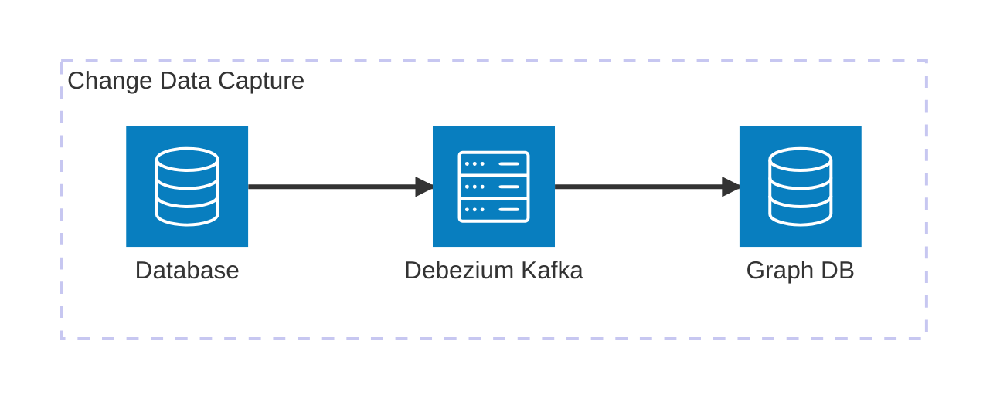
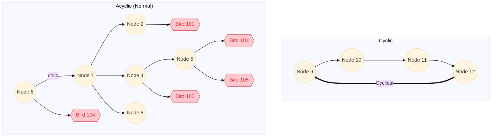

# Birds API

## Steps taken to solve
1. Setup Boilerplate rails application using `rails new birds-api --api -d postgresql`
2. Delete extra goodies we don't need (ActionCable, Etc)
3. Unzip nodes.csv.gz using `gzip -d data/nodes.csv.gz`
4. Create the database `bundle exec rake db:create`
5. Create the model using `rails g model nodes`
6. Create the table using `bundle exec rake db:migrate`
   * Note, I decided not to use foreign key constraints as in the future we may need to add children before their parents.
7. Seed the initial data using `rails db:seed`
   1. Based on data it is clear that foreign keys should not be used, therefor they have been omitted.
8. Write Recursive CTE functions to efficiently traverse trees.
9.  Use `fx` gem to manage migrations of CTE functions
10. Add `ancestors`, `self_and_ancestors`, `descendents`, `self_and_descendents`, `common_ancestors`, `root`, `depth`, and `lowest_common_ancestor`, methods to the `Node` model
11. Add `search_by_node_ids` to the `Bird` model
12. Add `rspec` & `rubocop`
13. Create the api contoller using `rails g controller CommonAncestors`
14. Update the `config/routes.rb`
15. Add the birds model using `rails g model Bird`
16. Add the birds controller using `rails g controller Birds`
17. Use Rubocop to clean up code
18. Add specs to handle cyclical trees.

## Steps needed to profile and optimize perfomance
1. Understand the shape of the data (distribution children / node)
   1. If the data is wide (many children per node), there won't be as many recursive loops.
   2. If the data is deep, there will be many recursive loops.
2. Create a load test database to test against, seed via seed generation script.
3. Benchmark performance, profile database queries

## Naive attempts at performance optimization
Without knowing the shape of the data, this is a comparison of methods to accomplish tree traversal.

#### Active Record Implementation
  - Pros: 
    - Easy to debug / Implement
  - Cons: 
    - Needs to make individual database calls for each layer of children
    - Initializing Objects on the appication layer will be very memory expensive
   ```
    # Returns list of ancestors, starting from parent until root.
    #
    #   subchild1.ancestors # => [child1, root]
    def ancestors
      node, nodes = self, []
      nodes << node = node.parent while node.parent
      nodes
    end
   ```
#### Postgres Based Implementations

##### Recursive CTE Implementation
- Pros: 
  - Tree traversal can be performed at the database level
  - Really clean active record implementation using `activerecord-cte` gem.
  - Using a read/write configuration a seperate read-only clone can be setup and optimized for memory allocation
  - `work_mem` can be increased to prevent large subqueries from hitting the disk
  - `max_parallel_workers_per_gather` and `max_parallel_workers` can be tweaked for parallelization of hash joins
  
- Cons: 
  - Can lead to some ugly CTE Code
  
- Notes:
  - Active Record CTE Implementation into ActiveRecord using `activerecord-cte` gem
  ```
    def self_and_ancestors
      # to_do: parameratize inputs
      Node.with(
        :recursive,
        node_ancestors: "
        SELECT n1.id, n1.parent_id, 0 AS depth, ARRAY[n1.id] AS path
        FROM nodes n1
        WHERE n1.id = #{id}

        UNION ALL

        SELECT t.id, t.parent_id, ta.depth + 1, ta.path || t.id
        FROM nodes t
        INNER JOIN node_ancestors ta ON t.id = ta.parent_id
        WHERE NOT t.id = ANY(ta.path)
      "
      ).joins('JOIN node_ancestors na ON nodes.id = na.id').order('na.depth')
    end
  ```
  - They are also composable
  ```
  def ancestors
    self_and_ancestors.where('nodes.id != na.id').order('na.depth')
  end
  ```
  - Wrapping CTE's in functions that return tables make them a little more efficient, but difficult to optimize.
    - [get_ancestors(node_id)](db/functions/get_ancestors_v01.sql)
    - [get_ancestors_and_self(node_id)](db/functions/get_ancestors_and_self_v01.sql)
    - [get_descendants(node_id)](db/functions/get_descendants_v01.sql)
    - [get_descendants_and_self(node_id)](db/functions/get_descendants_and_self_v01.sql)
    - [get_descendant_birds(node_ids)](db/functions/get_descendant_birds_v01.sql)
  
  Get Ancestors CTE Function
  ```
    EXPLAIN ANALYZE WITH RECURSIVE node_ancestors AS (
      -- TO DO, maybe persist this in a temp table instead of an array
      SELECT n1.id, n1.parent_id, 0 AS depth, ARRAY[n1.id] AS path
      FROM nodes n1
      WHERE n1.id = 5
      
      UNION ALL
      
      -- Recursively select parents
      SELECT t.id, t.parent_id, ta.depth + 1, ta.path || t.id
      FROM nodes t
      INNER JOIN node_ancestors ta ON t.id = ta.parent_id
      -- Stop recursion if we've already visited this node (to prevent loops)
      WHERE NOT t.id = ANY(ta.path)
    )
    -- Return all ancestors
    SELECT na.id, na.depth
    FROM node_ancestors na
    WHERE na.id != 5; -- Exclude the start node itself
  ```
  CTE Query Plan
  ```
    CTE Scan on node_ancestors na  (cost=14.49..14.97 rows=20 width=12) (actual time=0.210..0.227 rows=3 loops=1)
      Filter: (id <> 5)
      Rows Removed by Filter: 1
      CTE node_ancestors
        ->  Recursive Union  (cost=0.00..14.49 rows=21 width=48) (actual time=0.094..0.219 rows=4 loops=1)
              ->  Seq Scan on nodes n1  (cost=0.00..1.02 rows=1 width=48) (actual time=0.091..0.093 rows=1 loops=1)
                    Filter: (id = 5)
                    Rows Removed by Filter: 9
              ->  Hash Join  (cost=1.04..1.30 rows=2 width=48) (actual time=0.027..0.028 rows=1 loops=4)
                    Hash Cond: (ta.parent_id = t.id)
                    Join Filter: (t.id <> ALL (ta.path))
                    ->  WorkTable Scan on node_ancestors ta  (cost=0.00..0.20 rows=10 width=40) (actual time=0.000..0.000 rows=1 loops=4)
                    ->  Hash  (cost=1.02..1.02 rows=2 width=12) (actual time=0.068..0.069 rows=10 loops=1)
                          Buckets: 1024  Batches: 1  Memory Usage: 9kB
                          ->  Seq Scan on nodes t  (cost=0.00..1.02 rows=2 width=12) (actual time=0.003..0.004 rows=10 loops=1)
    Planning Time: 12.308 ms
    Execution Time: 0.583 ms
  ```
  CTE Function Query Plan (More Performant, Less Transparent)
  ```
  explain ANALYZE select * from get_ancestors(5);

  Function Scan on get_ancestors  (cost=0.25..10.25 rows=1000 width=12) (actual time=0.181..0.181 rows=3 loops=1)
  Planning Time: 0.032 ms
  Execution Time: 0.202 ms
  ```

##### Recursive Function Implementation
- Pros: 
  - Tree traversal can be performed at the database level
  - Recursive function will make use of table indexes
      
- Cons: 
  - More difficult implimentation into active record
  - Will be sort of hard to maintain in the codebase, can lead to ugly code
  - Dealing with cyclical loops more difficult
  - Lack of transparency into function query plan
  ```
    CREATE OR REPLACE FUNCTION get_ancestors(node_id INTEGER)
    RETURNS TABLE(id BIGINT) AS $$
    BEGIN
      RETURN QUERY
      SELECT (get_ancestors(n.parent_id)).*
      FROM nodes n with n.id = node_id
      
      RETURN QUERY
      SELECT n2.id
      FROM nodes n2
      WHERE n2.id != node_id; -- Exclude the start node itself
    END;
    $$ LANGUAGE plpgsql;

    SELECT * FROM get_ancestors(node_id);
  ```

##### LTREE Implementation (Pre-Processing)
- Pros:
  - Fast reads, as Built in functionality of ltree datatype removes the need for tree traversal.
  - Can be indexed using GIST
  - Fairly simple SQL syntax for ancestors, descendents
  - Good for data that does not get updated very often
- Cons: 
  - Slow writes, Deeply nested trees would require cascading updates.
  - Since db records can be updated from an outside service triggers or cdc would need to be setup on the table
  - Unclear if there are size limitations / performance implications for deeply nested trees
  ```
    SELECT
      *
    FROM
      myTree
    WHERE
      path @> (
        SELECT
          path
        FROM
          myTree
        WHERE
          label = 'C'
      );
  ```

##### Realtime ETL to Graph DB (Pre-Processing)
CDC (Change Data Capture) Can be setup on the nodes table and publish events for processing. Queue workers can subscribe to the queues and take the events from the queue, and make the necessary updates to the graph db in near realtime

- Pros: 
  - Fast reads, graph databases are very good at tree traversal.
  - Probally the most scalable solution for extremely large datasets.
      
- Cons: 
  - More complicated to setup
  - Graph DB can get out of sync
  - Difficult to implement into active record



## Getting Started
1. Clone repo
2. Install the required gems `bundle install`
3. Create the database `bundle exec rake db:create`
4. Perform migrations `bundle exec rake db:migrate`
5. Start Server `rails s`

## Testing
1. run `bundle exec rspec` to run all specs

### Initial Test Data 
Initial Test data is provided in the `spec/spec_helper.rb`
```
def setup_data
  Node.create!(id: 7, parent_id: 6)
  Node.create!(id: 6, parent_id: nil)
  Node.create!(id: 2, parent_id: 7)
  Node.create!(id: 4, parent_id: 7)
  Node.create!(id: 8, parent_id: 7)
  Node.create!(id: 5, parent_id: 4)

  Node.create!(id: 9, parent_id: 12)
  Node.create!(id: 10, parent_id: 9)
  Node.create!(id: 11, parent_id: 10)
  Node.create!(id: 12, parent_id: 11)

  Bird.create!(id: 101, node_id: 2)
  Bird.create!(id: 102, node_id: 4)
  Bird.create!(id: 103, node_id: 5)
  Bird.create!(id: 104, node_id: 6)
  Bird.create!(id: 105, node_id: 5)
end
```


### Visualization of Test Data

