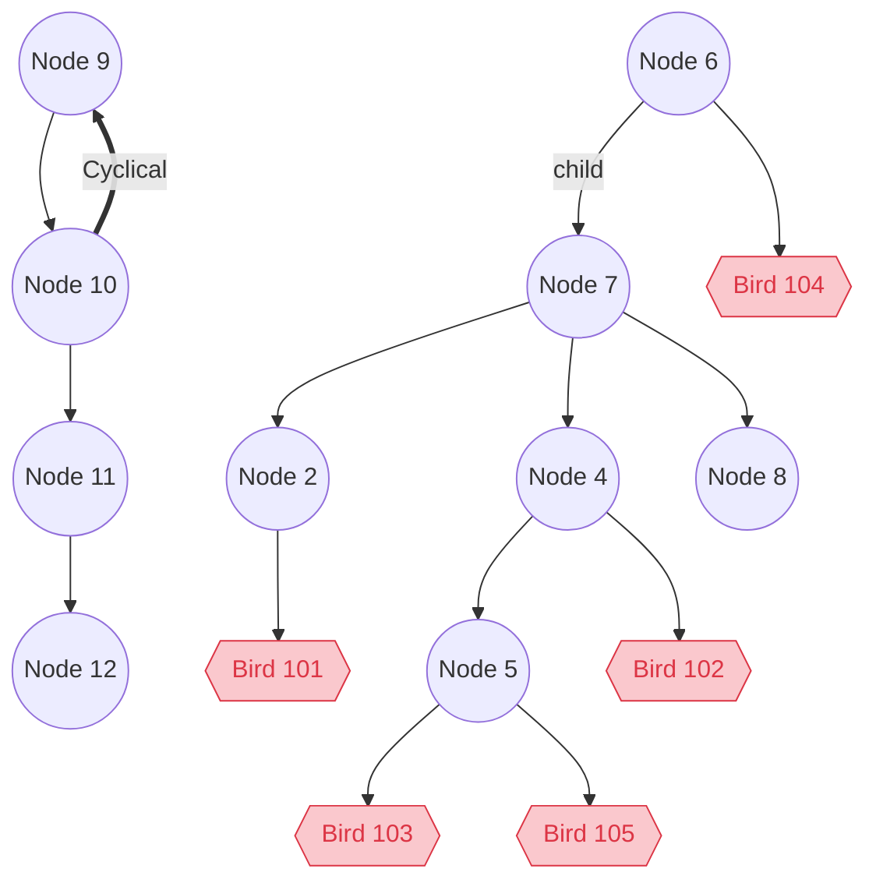

# README

## Steps taken to solve
1. Setup Boilerplate rails application using `rails new birds-api --api -d postgresql`
2. Delete extra goodies we don't need (ActionCable, Etc)
3. Unzip nodes.csv.gz using `gzip -d data/nodes.csv.gz`
4. Create the database `bundle exec rake db:create`
5. Create the model using `rails g model nodes`
6. Create the table using `bundle exec rake db:migrate`
   * Note, I decided not to use foreign key constraints as in the future we may need to add children before their parents.
7. Seed the initial data using `rails db:seed`
8. Choose `acts_as_tree` gem to handle self references
9. Add `parents`, `root`, and `lowest_common_ancestor` methods to the model
10. Add `rspec` & `rubocop`
11. Create the api contoller using `rails g controller CommonAncestors`
12. Update the `config/routes.rb`
13. Add the birds model using `rails g model Bird`
14. Add the birds controller using `rails g controller Birds`
15. Use Rubocop to clean up code
16. Add specs to handle cyclical trees.

## Model Selection
Decide between the following ways to model the self referencing relationship
   1. Using `acts_as_tree` gem provides the following out of the box
      1. `parent` and `children` relationships
      2. `descendants`, `self_and_descendants`, `parents`, and `self_and_parents` instance methods
      3. While testing i encountered and error when processing cyclical branches. To fix this i modified the implementation of `parents` and `descendents` to handle cyclical relationships
   2. Using `acts_as_sane_tree` allows this recursion to be built into postgres using recursive queries, however I decided not to take this route for various reasons
      1. Recursive queries are harder to read and debug.
      2. May cause unecessary load on the db.
      3. Down the line this is probally more efficient however i would wrap these recursive queries in stored procures.

## Getting Started
1. Clone repo
2. Install the required gems `bundle install`
3. Create the database `bundle exec rake db:create`
4. Perform migrations `bundle exec rake db:migrate`
5. Start Server `rails s`

## Testing
1. run `bundle exec rspec` to run all tests

### Initial Test Data 
Initial Test data is provided in the `spec/spec_helper.rb`

The data is in the following format

